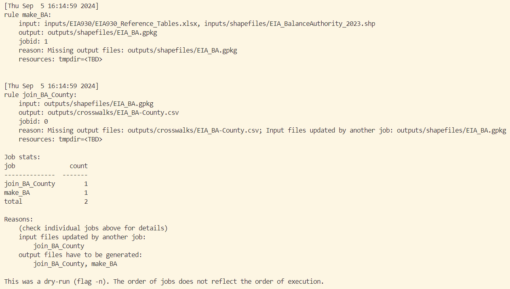
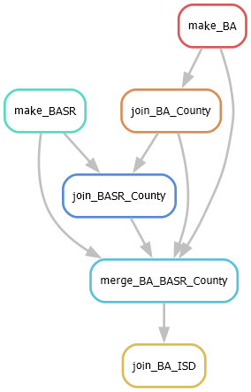

# Data Workflow Management via Snakemake

### Table of Contents

- [Introduction](#introduction)
- [Overview of data pipeline](#overview-of-data-pipeline)
- [What is Snakemake?](#what-is-snakemake)
- [EIA Use Case -- Working with Snakemake](#eia-use-case----working-with-snakemake)

## Introduction

One of the objectives of BlueSky is to **“select data formats, tools, and procedures for a data management framework to organize, pre-process, and post-process data”.** Modeling teams at EIA work with a variety of programming languages, workflow structures, and data sources. Additionally, the range of available data, licensing agreements, complexity of tasks, and developer preferences make workflow standardization difficult. 

We wish to find a balance between replicability and module-specific, use-case flexibility. To this end, we have explored various options for data management software and tools to create more replicable, organized, and flexible workflows, motivated by a few guiding questions:
- How do we make these processing steps more tractable for new/existing team members?
- To what extent can we make pre-processing steps replicable for internal/external users?
- How portable can our newly organized workflows be into the future?
- Can we aid/augment existing skills and programming language preferences?


### What is this data pipeline repository?
This repository contains a working, EIA-case specific example of the use of Snakemake, an open source data workflow management tool. The workflow constructs geospatial crosswalks between different spatial scales (e.g. counties and electricity balancing authorities), downloads electricity demand data and runs a regression to fit it to publicly available, station-level weather data. Ultimately, this data is used for the BaseLoad.csv file in the residential inputs.

Note this is only an example of a workflow, and has not been implemented for the entire prototype.

When working through the Snakefile and and the workflow, ***we recommend dry-running the pipeline versus actually executing the rules***. Dry-running the pipeline builds the workflow, checks which rules must be executed based on file existence and dates of modification, and then reports the jobs required without executing the code or scripts in each rule. This allows you to test the capabilities of Snakemake without running R or Python code. More information on dry-running Snakemake workflows can be found below.

The scripts that each rule executes are built to download large amounts of data (10+GB) from web-links and construct database files. This stack generates hourly weather data for all counties in the contiguous United States; executing the entire workflow takes hours to complete. If you want to replicate this workflow, be sure to set your census key and your database file locations at the top of the Snakefile (see comments in the Snakefile for assistance). **Be sure to navigate to the *sample/baseload_data_pipeline* directory to work with Snakemake and the workflow.**

### What is in this README?

This guide illustrates how to build data pipelines via Snakemake. The guide provides a high-level introduction to Snakemake and then discusses the best use-cases for Snakemake as discovered (so far) in testing. The guide then works through creating a Snakemake workflow, and generating graphs of the workflow.

This document should provide everything needed for general testing of this Snakemake workflow. For information on the variety of features and methods available for building Snakemake workflows, one can refer to the extensive documentation available via the [Snakemake website](https://snakemake.readthedocs.io/en/stable/index.html).

## Overview of baseload data pipeline

This directory contains data sourcing scripts for the `BaseLoad.csv` input file used within the residential model. This project sources data from the National Oceanic and Atmospheric Administration's (NOAA) weather station data and electricity demand data from EIA's [Hourly Electric Grid Monitor](https://www.eia.gov/electricity/gridmonitor/dashboard/electric_overview/US48/US48). We also use population data from the U.S. Census. 

Weather data is downloaded, cleaned, and aggregated into individual US counties. Balancing Authorities (BA) and sub-regional BAs (SR-BA) electricity demand data is downloaded and cleaned. A regression model fits the 2019-2022 weather data to electricity demand data for each region. Demand is predicted for additional weather years (defaulted to 1990-2018). A demand profile is generated for each BA/BA-SR by averaging across all years. The BA/BA-SR demand profiles are mapped to the prototype regions to produce the `BaseLoad.csv` input file for the prototype.

#### Mappings

The mapping scripts make and join data to generate the regional assignments used through out the rest of the project and are used to create the `NOAA_ISD_Stations.csv`, `EIA_County-ISD.csv`, and `EIA_BA-BASR-County.csv` files as well as other itermediate files. These scripts include:
 - `make_BA.R`
 - `make_BASR.R`
 - `join_BA-county.R`
 - `join_BASR-county.R`
 - `join_BA-BASR.R`
 - `join_BA-noaa.R`

The `NOAA_ISD_Stations.csv` contains the list of NOAA stations, `EIA_County-ISD.csv` identifies the "n" number of closest weather stations for each county, and `EIA_BA-BASR-County.csv` assigns counties to the BA/BA-SR regions. 

#### NOAA weather data

The `make_noaa.py` script constructs the NOAA weather data and county-BA crosswalk table definitions for SQL and downloads the NOAA data for each county from NOAA's [National Centers for Environmental Information data platform](https://www.ncei.noaa.gov/data/global-hourly/access).  

Then, the `clean_noaa.py` script aggregates the county-level data to a BA-level weather series using weighted averages of county variables, with the weights determined by county population.

#### EIA930 data
The `create_inputs.py` script downloads the necessary EIA930 files from EIA's [Hourly Electric Grid Monitor](https://www.eia.gov/electricity/gridmonitor/dashboard/electric_overview/US48/US48).

The `system_shape.py` script cleans the EIA930 data to combine all EIA930 files, fill in missing data, and remove extreme outliers.

#### Regression

The `weather.R` script combined hourly NOAA weather data (from 1990-2022) and hourly EIA930 electricity demand data (from 2019-2022) to fit a regression on actual demand data, predict historical load data based on weather data, and take the average hourly demand over predicted and actual demand values.

The weather data used for the regression consisted of: 
- the heating degree hour*, 
- the cooling degree hour* (both of these were interacted with a dummy variable specifying whether it was a weekday or a weekend day), 
- the previous day's heating degree day*, 
- the previous day's cooling degree day*,
- a three-hour rolling average relative humidity,
- cold wind speed*,
- and hot wind speed*.

\* The heating/cooling degree cutoff (also determining hot vs cold wind) is 65 degrees F.

Other non-weather data used for the regression:
- day of week
- hour of day
- year

#### Final Product

The `agg_EMMregions.py` script takes the load predictions generated by the weather.R script and creates the final BaseLoad.csv file. It takes the BA/BA-SR load predictions and shares out the hourly demands by county. It then sums up the county-level load predictions up to the prototype regions defined in `cw_r.csv`.


## What is Snakemake?

### Overview
Snakemake is an open-source workflow management tool to create reproducible and scalable data analyses. Users write workflows in a *snakefile* detailing a series of interlinking workflow *rules*  based on file inputs and outputs via a human-readable, python-based configuration language. 

Users operate and execute the snakefile using a Conda-enabled terminal. It is designed to be highly compatible with Conda, and this document will illustrate how to integrate a conda-enabled terminal into VSCode.

### When Should I Use Snakemake?

Snakemake allows for the execution of R, Python, Bash, Rust, and Julia code, as well as the direct specification of Python code within the Snakefile, **making it very useful for workflows that incorporate a variety of software**.

Snakemake examines the interrelationships between rules and checks whether a rule should be scheduled to run based on the date of modification of the outputs versus the inputs (and the executable/script). **Snakemake is excellent for executing workflows with a high degree of interdependence.**

**Snakemake is also useful if certain rules need to be run at different timings, or if certain potions of the workflow need to be run.** For instance, if a computationally intensive task needs executed only once, Snakemake will not rerun that rule even if the user targets a "downstream" rule because the outputs already exist.

Finally, **Snakemake makes feeding arguments to scripts easy**, even if the scripts are in different programming languages, which makes the construction of flexible, function-like workflows easier. Because Snakemake is pythonic, the user can create python "objects" in a snakefile (or a config file for Snakemake) that are accessible to the scripts specified in each rule. 

**In general, Snakemake is great when...**

* Your workflow can be decomposed into a bunch of steps that are interdependent, but can run separately
* These steps all need to be run/rerun at different cadences
* You have multiple programming languages in the workflow
* Each step requires inputs from previous steps, and things go wrong if they are not present
* The workflow is best thought of as a function (e.g. the same workflow is repeated over again for different datasets, years, methods, etc.)

## EIA Use Case -- Working with Snakemake

### Checking Installation

All software necessary for working with Snakemake is contained within the *bsky* Conda environment. 

For help creating the environment, you can navigate to the main README located in the root directory of the *Bluesky_Prototype* repo and see the *Usage* section. 

Once you've created *bsky*, with an open Conda-enabled terminal, activate the environment; 

```bash
conda activate bsky
```

You can test whether snakemake was installed by checking the version.

```bash
snakemake -v
```

Navigate to the sample/baseload_data_pipeline directory. Assuming you are in the root directory of the *Bluesky_Prototype* repository...

```bash
cd sample/baseload_data_pipeline
```

The control file for Snakemake is called a Snakefile, and the first step in any new Snakemake workflow is to create a snakefile in the working directory of your project. Open up the [Snakefile](./Snakefile) in your IDE of choice.

### Building and Testing Workflows

#### Configurations
The `config.yaml` file contains the settings for this pipeline project. In order to run the project, you will have to update the `db_directory` parameter to point to your personal directory. 

Before running the entire snakemake project, you may consider running a smaller version of the project by setting the NOAA start year to "2019" and the number of stations to "2". With these test settings in place, one should still expect the project to run overnight.  

The other configurations should not be changed. Future versions of this project will allow for more flexibility in the input configurations. 

#### Snakemake
The *Rule* is the building block of Snakemake workflows. It specifies input files, executables that transform inputs into outputs, output files, and other items such as log files, rule-specific Conda environments, and parameters.

At its most basic, a *Rule* is composed of a name, input files, output files, and an executable. This can be a script (e.g. script.py or script.R) or Python code. Here is an example of a rule from this data pipeline.

```bash
rule make_BA:
    input:
        "inputs/EIA930/EIA930_Reference_Tables.xlsx",
        "inputs/shapefiles/EIA_BalanceAuthority_2023.shp"
    output:
        "outputs/shapefiles/EIA_BA.gpkg"
    script:
        "scripts/s_BA_Make.R"
```

The `make_BA` *Rule* takes two file inputs and upon successful execution of the script *s_BA_Make.R*, generates the output file *EIA_BA.gpkg*, which is a cleaned geopackage file describing electricity balancing authorities (BAs) in the U.S. Note that we are supplying this *Rule* the location of an R script to execute.

Let's build a workflow using this single *Rule*; in your terminal, dry-run just the rule above by executing...

```bash
snakemake -np outputs/shapefiles/EIA_BA.gpkg
```

By using the -np command, we build the workflow without executing the provided script. In essence, we are examining what would need to run to obtain an up-to-date version of the desired output. 

Snakemake constructs the workflow contained in the Snakefile and examines whether it should run each *Rule* to construct the output based on whether:
* The output files exist
* The output files are older than the input files
* The output files are older than the executable (e.g. the script)
* Whether the rules have changed since last execution

The terminal should show you the "jobs" required to create the output file *EIA_BA.gpkg*. The *Snakefile* shows the other *Rules* which depend on this output file.

```bash
rule make_BA:
    input:
        "inputs/EIA930/EIA930_Reference_Tables.xlsx",
        "inputs/shapefiles/EIA_BalanceAuthority_2023.shp"
    output:
        "outputs/shapefiles/EIA_BA.gpkg"
    script:
        "scripts/s_BA_Make.R"

rule join_BA_County:
    input:
        "outputs/shapefiles/EIA_BA.gpkg",
    output:
        "outputs/crosswalks/EIA_BA-County.csv"
    params:
        years_sm = YEARS
    script:
        "scripts/s_BA-County_Join.R"
```

The rule `join_BA_county` spatially joins BAs to U.S. counties and requires `EIA_BA.gpkg` as an input, meaning that this rule is dependent upon the execution of a rule upstream. 

We can see this via the scheduled jobs by executing a dry-run and targeting `EIA_BA-County.csv`...

```bash
snakemake -np "outputs/crosswalks/EIA_BA-County.csv"
```

Now, the output in the terminal should show two jobs scheduled, as the rule `make_BA` must run to create the input files needed for `join_BA_County`.



Note the `Params:` attribute of the `join_BA_County` *Rule*. When the executable provided for a *Rule* is a script, all arguments in the *Rule* are available in the scripts being executed. For example, when running ```scripts/s_eia930_tables.py``` in the *Rule* `make_EIA930`, this instance of Python has access to `Params:`

```python
sm_dbloc = snakemake.params["db_loc"]
sm_years = snakemake.params["years_sm"]
sm_deletedb = snakemake.params["deletedb"]
```

Similarly, for R, for the *Rule* `join_BA_County`, this is available in list format as...

```r
v.years.sm <- snakemake@params$years_sm
```

In other words, **Snakemake allows you to clearly elucidate arguments fed into executables within the *Rule* definitions**, as well as built workflows that include wildcards for inputs and outputs. This is a powerful tool for reproducibility and scalability. 

Additionally, rather than a script, one can specify Python directly as follows using the ```run:``` attribute in place of ```script:```. Alternatively, one can specify shell commands as the executable via ```shell:```

### Vizualizations

Let's vizualize the first portion of the workflow. To vizualize the Directed Acyclic Graph (DAG), run the following command. Note that one can also add the ```-f``` tag to force-run the DAG.

```bash
snakemake --dag "outputs/crosswalks/EIA_County-ISD.csv" | dot -Tpng > "images/dag_location.png"
```

If the workflow is valid, one should observe the desired output file in the images directory.



Note that the boxes are solid, meaning that these would need to run. If the file already exists, the DAG would render the nodes (or *Rules*) as dashed borders.

### Executing the Workflow

Snakemake works via command line execution where the user targets the output file of interest (including the wildcards). To execute, the user calls snakemake in the Conda-enabled terminal, specifying the output file of interest and the number of cores available to run the scheduled jobs.

```bash
snakemake --cores [n_cores] "[filename]"
snakemake --cores [n_cores] "[filename]" -f
snakemake --cores [n_cores] --forceall
```

The ```-f``` tag forces the run even if the output file exists and passes other checks for runs.

Let's fully execute the first *Rule* of the workflow and vizualize the DAG after execution. Run the following command:

```bash
snakemake --cores 4 "outputs/shapefiles/EIA_BA.gpkg"
```

The terminal should report the execution of the R script, as well as indication from Snakemake that the job was completed. Once executed, vizualize the workflow as before. Notice the difference in the two graphs.


The outputs have been created in the `make_BA`, and there have been no changes to the scripts or inputs for the *Rule*. Therefor, Snakemake does not include `make_BA` in the workflow DAG for obtaining the outputs in `join_BA_ISD`.